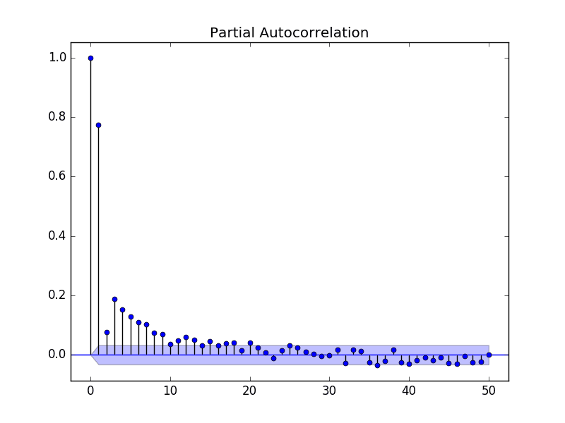
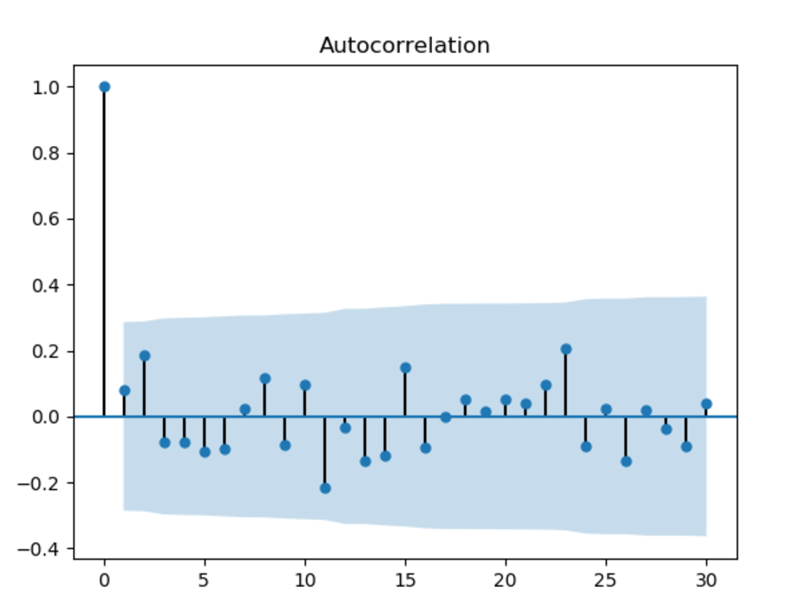
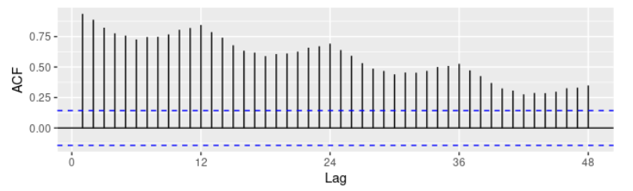

# The Basics of Time Series

The codes discussed are available on the folder codes.

## 1. What are time series?

A time series is a collection of observations of well-defined date items obtained through repeated measurements over time. Consider the graphic below.

That graphic show the number of air passagenrs throught time and it is an example of a time series. Here the time is the independent variable.

If you take a moment to analyse the time series presented above, you will notice somethings about it. For an instance, you can observe that the number of air passangers is in general increasing over time. You can also notice that the number goes up and down over the range of an year. And last, you can see that the number shown has also an randomic component, that we can call noise. 

In that sense, we can say that every time series can be divided into four components:

- Level - the avarage value in the series
- Trend - the increasing or decreasing of values
- Seasonality - repeated cycle over the series
- Noise - randomness in the series

In the image below you can see a time series divided into the level + the trend, the seasonality and the noise.

With those concepts covered, we can now talk about the use of time series to make forecasts of future values. Here, we will talk about two methods: inferential statistic and deep learning. To understand the approaches that we are going to talk about, you need some basic understanting of statistics, such as: hipotesys test, Q-Q plot, histograms and so on. We will cover the concepts of Autocorrelation and White Noise.

## 2. Autocorrelation and White Noise

The correlation measures the extent of a linear relationship between two variables, so autocorrelation measures the linear relationship between *lagged* values of a time series. This means we have multiple autocorrelation coefficients, each corresponding to a different lag.

For example:
- $r_1$ is the autocorrelation of $y$, between $y_{t}$ and $y_{t-1}$
- $r_2$ is the autocorrelation of $y$, between $y_{t}$ and $y_{t-2}$
- etc

We normaly visualize the autocorrelation function with with an scatter plot, where the x-axis is the lag and the y-axis are the coefficients. The plot is also known as correlogram. See an example below:

We can see that the autocorrelation with lag 0 is equal to 1, which is always true, given that $y_t$ = $y_t$. The autocorrelation with lag 1, in this example, is equal to 0.8, the one with lag 2 is equal to 0.1 and so on. The purple area close to the x-axis is our interval of significance, that help us determine if the coefficient is significant or not. In our case, the autocorrelation with lag greater then 10 is not significant.

When a time series has no autocorrelation, it's called white noise. The white noise is a purely stochastic (random) process and the ACF plot should not show any significat autocorrelation coefficients, as seen below.

Some intersting properties we can observe in the ACF are the trend and the seasonality. Observe the plot below:

The slow decrease in the ACF as the lags increase is due to the tren, while the wavy shape is due the seasonality.

## 3. Stationary and Differencing

A stationary time series means that its properties do not change over time. Therefore, it has constant mean and variance, and covariance is independent of time. For example, a time series with trend and/or seasonality is not stationary, while white noise is.

Differencing is a transformation, a way to make a time series stationay by removing trend and stabilising the mean. In this transformation, we simply take the difference between consecutive observations. We can do it more than once and rarely we have to do it more than twice.

Other transformation used to reduce variance is taking the logarithm.

## 4. Some simple forecast methods

Some forecast methods are extremely simple and surprisingly effective in some cases. It is important to know those methods, because it's always better to use a simple method if a complex one is producing results that are the same or worse.

### 4.1. Average Method

In this method, the forecast of all future values are equal to the avarage of the historical data.

$$ ŷ_{T+h|T} = (y_1 + ... + y_T)/T $$

The notation $ŷ_{T+h|T}$ is a short-hand for the estimate of $y_{T+h}$ based on the data $y_1,...,y_T$.

### 4.2. Naive Method

For naive forecasts, we simply set all forecasts to be the value of the last observation. This method works remarkably well for many economic and financial time series. Naive forecasts are optimal when data follow a random walk (see statistics), so they are called random walk forecasts.

### 4.3. Seasonal Naive Method

In this case, we set each forecast to be equal to the last observed alue from the same season. For example, with monthly data, the forecast of all future March values is equal to the last observed March value.

### 4.4. Drift Method

In this method, which is a variation of the Naive Method, the forecast can increase or decrease over time, and the amount of change over time (called drift) is set to be the average change seen in the historical data. This is the equivalent of drawing a line between the first and last observations, and extrapoling it into the future.

You can see the implementating of those methods in the Jupyter Notebook [simplemethods.ipynb](codes/simplemethods.ipynb).

## 5. Residual Diagnostics

The "residuals" in a time series modela are what is left over after fitting a model. For many (but not all) time series models, the residuals are equal to the difference between the observations and the corresponding fittied values.

Residuals are useful in checking whether a model has adequately captured the information in the data. A good forecasting method yield the following properties:

1. The residuals are uncorrelated. If there are correlations between residuals, then there is information left in the residuals which should be used in computing forecasts.
2. The residuals have zero mean. If the residuals have a mean other than zero, then the forecasts are biased.

In addition to these essential properties, it is useful (but not necessary) for the residuals to also have the following properties:

3. The residuals have constant variance.
4. The residuals are normally distributed.