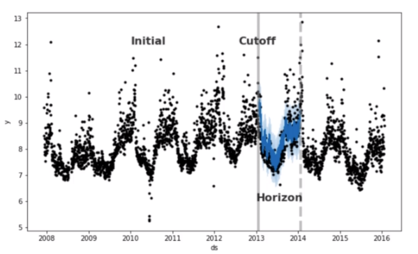

# Prophet

In this section we are going to talk about Prophet, one of the most widespread libraries in the industry for automated Time Series Analysis. 

Prophet is a forecasting procedure implemented in R and Python. It is fast and provides automated forecasts that can be tuned by hand. It is a open source software from Facebook's Core Data Science team.

Why should we use it?
- It is fully automatic, so it means we can very quickly get forecasts
- It can handle non-linear trend, missing data, outliers, changing trends and holiday effects
- It is fast and tunable

When to use it?
- It works best when a lot of data is available
- It is very good when time series have strong seasonal effects

## Prophet's Functionality

As you can see in the code Prophet.ipynb, the model can easily find the trend and the seasonalities of the dataframe without any pre-processing. You can make a model very easily in a matter of seconds. But let's explor some of the library's functionalities.

### 1. Trend Changepoint

Prophet can automatically detect point in time where the trend changes. It can determine a large number of potential changepoints at which the trend can change and then it will select as few changepoints as possible to avoid overfitting noisy fluctuations.

The number of changepoints can be tuned with the parameter `n_changepoints`. By default, Prophet will consider the first 80% of the time series to identify trend changepoints. We can change this range with the parameter `changepoint_range`.

### 2. Trend Flexibility

If Prophet is overfitting or underfitting, we can change the flexibility of the trend.

This can be tuned with `changepoint_prior_scale`. By default, the value is set to 0.5
- Increasing the value will make the model **more** flexible (more variance)
- Decreasing the value will make the model **less** flexible (more bias)

### 3. Seasonality

Seasonalities are estimated using a partial Fourier sum. We can specify the order of the partial sum to account for higher-frequency changes.

For example, yearly seasonalities uses a partial Fourier sum with 10 term, which we can modify with the term `yearly_seasonality`. Increasing the term may overfit the data, so we have to be careful.

### 4. Uncertainty Intervals

By default, Prophet displays an 80% uncertainty interval. We can adjust that with the parameter `interval_width`.

### 5. Cross-validation

We can quickly use cross-validation to evaluate our model and perform hyperparameter tuning.

The `cross_validation` function expects three parameters:
1. `initial`: the initial training period
2. `horizon`: the length of period forecast
3. `period`: tha spacing between cutoff dates

The rule of thumb says that we:
1. Set our `horizon` first
2. Set `initial` to be three times the `horizon`
3. Set `period` to be half the `horizon`

Look below what each parameters means:

### 6. Hyperparameter Tuning

Usually, we tune the following parameters:
- `changepoint_prior_scale`: try values between 0.001 and 0.5
- `seasonality_prior_scale`: try values between 0.01 and 10
- `holidays_prior_scale`: try values between 0.01 and 10
- `seasonality_mode`: try *additive* or *multiplicative*

The code that show all these functionalisties is the Prophet.ipynb, located in the folder codes. You can also check out the code ProphetProject to see a forecast project using Prophet.