# Statistical Learning Approach

In this section we are going to talk about the statistical approach to predict a time series. The codes are available in the folder codes.

## 1. Basic Models

### 1.1. Random Walk

A Random Walk model is one where the value at a given time $(y_t)$ is the value at the previous time $(y_{t-1})$ plus a random noise, that is normally distribuited (with mean of 0 and variance of 1). 

Therefore, the formula for the Random Walk is:

$$ X_{t} = X_{t-1} + Z_{t} $$

If we substitute $X_{t-1}$ with its respective formula and so on, we end up with the following:

$$ X_{t}=\sum_{i=1}^{t} Z_{i} $$

Below we can see an example of a simulated Random Walk:

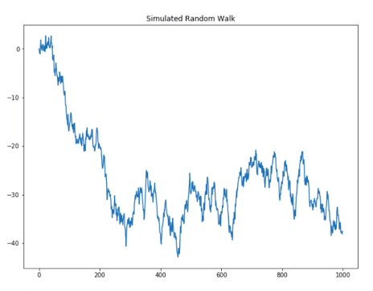

The ACF of the Random Walk Model looks like the following:

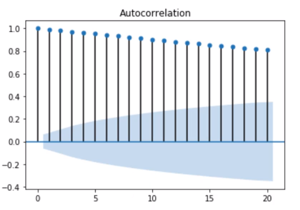

We can see that the autocorrelation starts very high and slowly goes down. That is an indicative of a trend. If we want to remove that trend, we can differenciate the series to get only the noise. If we do that, we get the following result:

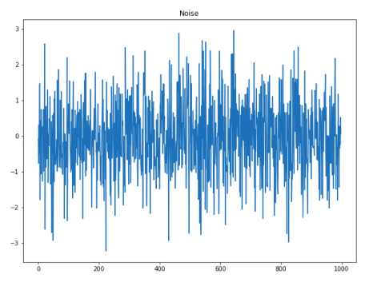

We can see now that there is no clear trend in the series and we have purely the noise. To make sure of that, we can also see the ACF of the difference:

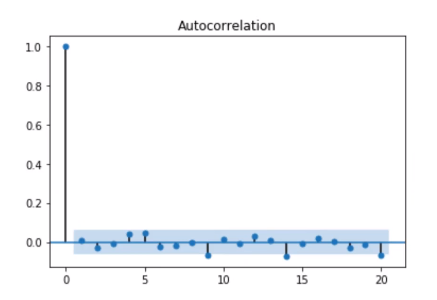

In the Jupyter Notebook [randomwalk.ipynb](./codes/randomwalk.ipynb) you can see the steps to simulate a Random Walk, plot its correlogram, differenciate and then see the ACF of the difference.

### 1.2. Autoregressive Model

The autoregressive model uses a linear combination of past values of the target to make a predicition. The term *autoregression* indicates that it is a regression of the target against itself. The Autoregressive Model of orden *p* can be written as:

$$ y_t = c + \phi_1y_{t-1} + \phi_2y_{t-2} + ... + \phi_py_{t-p} + \varepsilon_t $$

where $\varepsilon_t$ is white noise. We refer to this as an AR(*p*) Model, an Autoregressive Model of order *p*.

The AR(*p*) Model is very flexible and can be used to model differente types of time series patterns, but it can only be applied to a stationary time series.

For example, look at this simulated AR(2) process.

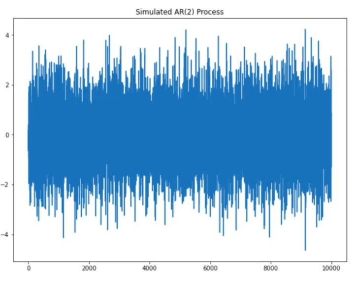

Take a look at its ACF plot

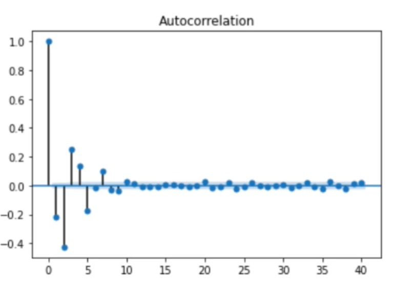

We can see some oscilation as well as a slow decay. If we look at the PACF (Partial Autocorrelation Process - finds the correlation between the present value and the residuals of the previous lag), we get a plot a like this:

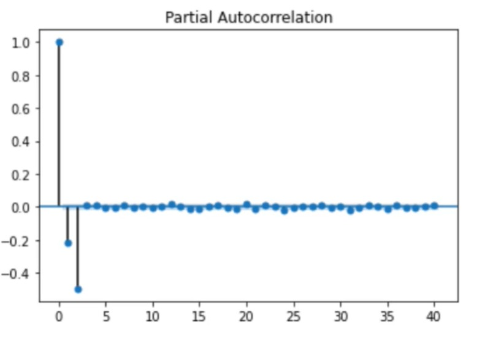

We can see that there is no significant peak after lag 2. Therefore, the PACF can be used to determinate the order of the Autoregressive (AR) Model.

You can see an example of the AR Model in the folder codes.

### 1.3. Moving Average Model 

Rather than using past values of the forecast variable in a regression, a Moving Average Model uses past errors in a regression-like model. Then we have:

$$ y_t = c + \varepsilon_t + \theta_1\varepsilon_{t-1} + \theta_2\varepsilon_{t-2} + ... + \theta_q\varepsilon_{t-q} $$

Here, $\varepsilon_t$ is white noise. We refer to this as an MA(q) Model, a Moving Average Model of Order *q*. Because we don't *observe* the values of $\varepsilon_t$ is not really a regression in the usual sense.

We can see below a simulatade Moving Average Process of Order 2:

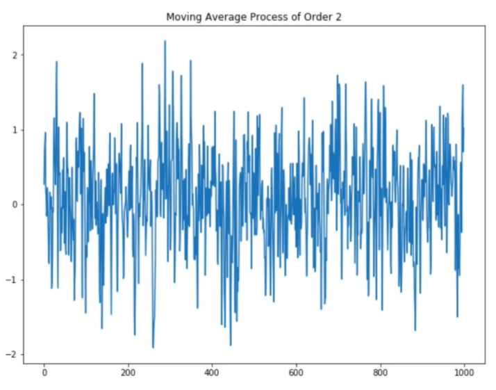

If we look at the ACF of this process, we can see that the autocorrelation decreases and is not significant after lag 2.

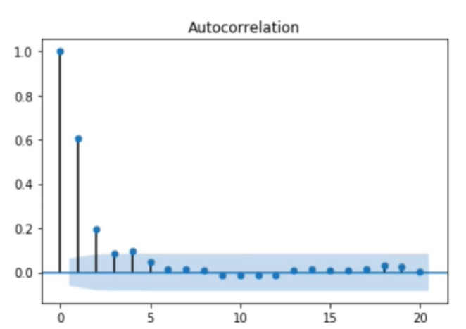

So, we can use the ACF plot to estimate the order *q* of a Moving Average Model.

The code of an simulated AM is in the folder codes.

### 1.4. ARMA: Autoregressive Moving Average Model

The Autoregressive Moving Average Model (ARMA) is a combination of an AR(p) and a MA(q) model. In that sense, the ARMA(p,q) expression can also be expressed as a combination of both, resulting in:

$$ y_t = c + \varepsilon_t + \phi_1y_{t-1} + \phi_2y_{t-2} + ... + \phi_py_{t-p} + \theta_1\varepsilon_{t-1} + \theta_2\varepsilon_{t-2} + ... + \theta_q\varepsilon_{t-q} $$

Here, $c$ is a constant, $\varepsilon$ is noise, $\theta$ are the parameters for the MA(q) portion and $\phi$ are the parameters for the AR(p) portion. Just as we did before, q is the order of the Moving Average Model and p is the order of the Autoregressive Model.

By combining both models, we can explain the relationship of the time series with both random noise (due to the Moving Average Model) and itself at a previous step (due to the Autoregressive Model). Look below at an example of a simulated ARMA Process:

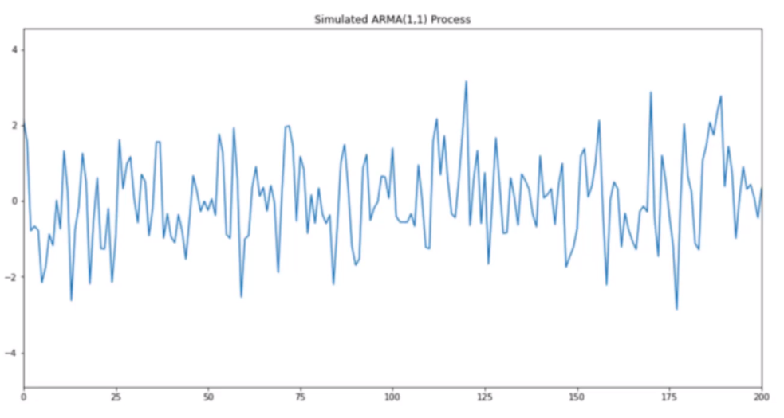

And now let's plot its ACF and PACF:

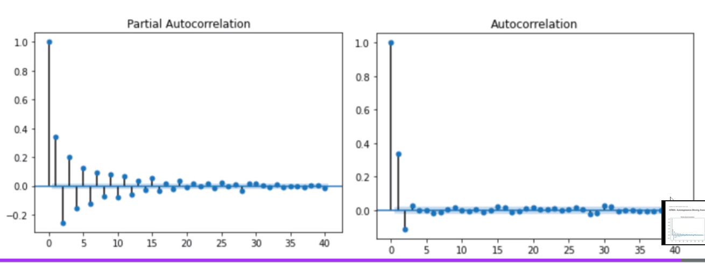

We can see that both plots a decaying sinusoidal pattern, which is a clear signal that we have both MA and AR processes happening.

You can find the code of the simulated ARMA Process and its ACF and PACF plots in the folder codes.

## 2. Advanced Models

### 2.1. ARIMA: Autoregressive Integrated Moving Average

ARIMA stands for Autoregressive Integrated Moving Average Model. It is the combination of an AR(p) Model, a MA(q) Model and differencing (here integration is the opposite of differencing).

The full model can be written as:

$$ y'_t = c + \varepsilon_t + \phi_1y'_{t-1} + ... + \phi_py'_{t-p} + \theta_1\varepsilon_{t-1} + ... \theta_q\varepsilon_{t-q} $$

where $y'_t$ is the differenced series (it may have been differenced more than once). Mathematically, the ARIMA(p,d,q) requires three parameters:

- p = order of the autoregressive part
- d = degree of first differencing involved
- q = order of the moving average part

Many of the models we have already discussed are special cases of the ARIMA Model:

| Model                  | ARIMA                         |
|------------------------|-------------------------------|
| White noise            | ARIMA(0,0,0)                  |
| Random walk            | ARIMA(0,1,0) with no constant |
| Random Walk with drift | ARIMA(0,1,0) with a constant  |
| Autoregression         | ARIMA(p,0,0)                  |
| Moving Average         | ARIMA(0,0,q)                  |

It can be hard to determine the values of p, d and q, even if we use the ACF and PACF plots. If the data are from the ARIMA(p,d,0) or ARIMA(0,d,q) model, then the ACF and PACF plots can be helpful, but if both p and q are positive, than the plots do not help in finding suitable values of p and q.

You can find the code where we simulate and forecast the ARIMA Process in the folder codes.

### 2.2. SARIMA - Season Autoregressive Integrated Moving Average Model

Now can add another layer of complexity to the model, which bring us to the SARIMA Model. The 'S' indicates that we will now consider the seasonality. The model can be written as follows:

$$ ARIMA(p,d,q)(P,D,Q)_m $$

where $(p,d,q)$ is the non-seasonal part of the model, $(P,D,Q)$ is the seasonal part of the model and m is the number of observations per period.

The seasonal part of an AR or MA model will be seen in the seasonal lags of the PACF and ACF. For example, an $ARIMA(0,0,0)(0,0,1)_{12}$ will show:

- a spike at lag 12 in the ACF but no other significant spikes
- exponential decay in the seasonal lags of the PACF (12, 24, 36 ...)

Similarly, an $ARIMA(0,0,0)(1,0,0)_{12}$ model will show:

- exponential decay in the seasonal lags of the ACF
- a single significant spike at lag 12 in the PACF

You can find the code where we simulate and forecast the SARIMA Process in the folder codes.

### 2.3. AIC: Akaike's Information Criterion

The Akaike's Information Criterion (AIC) is useful to determining the order of an ARIMA Model. It can be written as

$$ AIC = -2\log(L) + 2(p + q + k + 1) $$

where $L$ is the likelihod of the data, $k=1$ if $c\ne0$ and $k=0$ if $c=0$. We also have The corrected AIC and the Bayesian Information Criterion (BIC), that are derived from the AIC and can also be used to determine the order of the ARIMA Model.

We will select the model with the lowest AIC compared to other models. The AIC cannot be used to select the order of differencing ($d$) becaus it will change the likelihood ($L$). Therefore, we can only compare AIC's that have the same constant $d$.

Notice that the higher the orders for ($p$,$q$) the higher the number of parameters and therefore the higher the AIC for the same likelihood. So, while more parameters might perform better, the AIC is used to find the model with the least amount of parameters while still having good results.

The AIC is simply a criterion to select a model. It can only be used relative to other models and is not a guarantee that the model will have a good performance on unseen data or that the errors will be small.

### 2.4. SARIMAX

A SARIMAX Model is a Season Autoregressive Integrated Moving Average that considers the effect of an outside variable on the target (the 'X' in SARIMAX denotes that we use exogenous variable to model and predict our target). 

SARIMAX is not a way to model a multivariate time series, meaning it does not predict more than 1 target. This model predicts only 1 target, but with the influence of another feature.

The code for the SARIMAX Model can be found in the folder codes.

### 2.5. General Modeling Procedure

Now that we have seen some different models, we can enumarate a procedure to model time series processes:

1. Plot data and identify unusual observations. Find the pattern in the data.
2. Apply a transformation or differencing to remove trend and stabilize variance.
3. Test for stationarity. If not stationary, apply another transformation or differencing.
4. Plot the ACF and the PACF to maybe estimate the order of MA or AR processes.
5. Try different combinations of orders and select the model with lowest AIC.
6. Check the residuals and make sure they look like white noise. Apply the Ljung-Box test.
7. Calculate forecasts

### 2.6. VAR: Vector Autoregression

Up until now, we have assumed a unidirectional relationship between the target and the feature, meaning that the feature impacts the target, but the target does not impact the feature. This isn't always necessarily the case.

This brings us to the subject of VAR, that means Vector Autoregression. This model is a generalization of the univariate autoregressive AR(p) model for forecasting of time series, in wich each time series is modelled as if they influence each other equally.

To use VAR, all time series in the system must be stationary. The order (p) of the VAR is chosen based on the AIC or any other metric of choice (MSE).

And, just like AR, we also have VARMA and VARMAX. The code for this models is available at the folder codes.

### 2.7. 