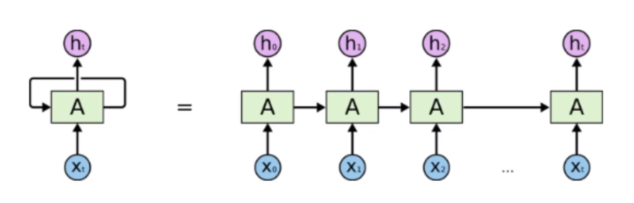
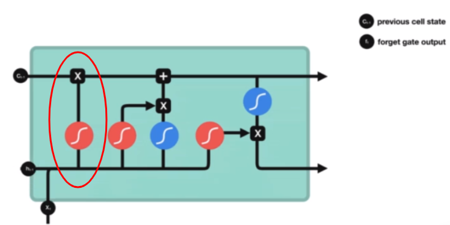
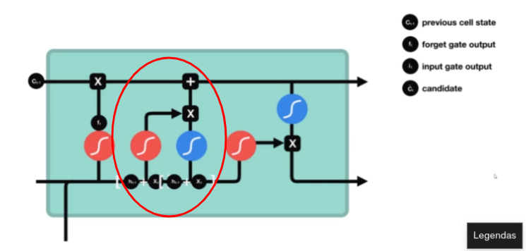
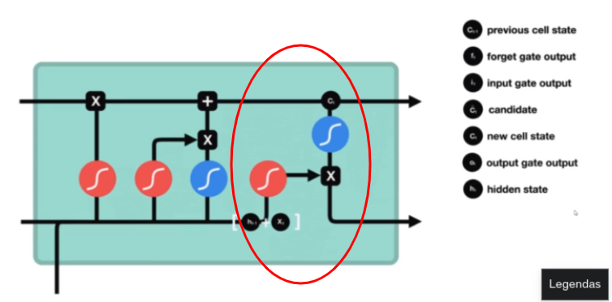

# Deep Learning Approach

In this section we are going to talk about the deep learning approach to predict a time series. The codes are available in the folder codes.

There are three deep learning architectures that we will explore specifically in the domain of time series analysis.

1. Simple Deep Neural Network (DNN)
2. Recurrent Neural Network with Long-short Term Memory (RNN + LSTM)
3. Convolutional Neural Network with Recurrent Neural Network (CNN + RNN)

The second optin is often used with sequetional data, that happens when a future step is dependent on a previous step.

We will not address the basic concepts of Deep Learning, but rather emphasize the use of deep learning in time series.

## 1. Deep Neural Networks (DNN)

As we have seen in the previous section, the statistical approach requires a lot of data manipulations before we can start modelling. We need to transform the data, make sure it is stationary, check the residuals, etc. However, with Deep Learning we have zero to no pre-processing: we can simply feed tha data to our network and train right away.

One drawback,however, is in simple DNNs inputs are considered to be independent of one another. But in time series, the future step is likely related to the previous step.

## 2. Recurrent Neural Network and Long-Short Ter Memory (RNN and LSTM)

In DNNs inputs are considered to be independent of one another, but RNNs have an internal memory to process sequences of inputs. Specifically, they can perfor a function for every input of data. The output is fed back into the network and used as input for the next data. Therefore, it uses the new data point and the output of the previous computation. Look at the image below:

On the left, you can see a recurrent neural network. On the right it is unfolded for all data points. Se now, we can use RNN to model a time series where the next step depends on the previous one.

However, there are a for drawbacks with RNNs: they suffer from short term memory, meaning that they do not carry information from very early steps. This is due to the vanishing gradient: during back propagation, the gradient gets very small and so early steps do not contribute as much to the learning.

Where RNN is an improvement over an DNN, Long-Short Term Memory (LSTM) is another improvement over and RNN.

LSTM is simply a modified RNN that uses three gates:

- Forget gate
- Input gate
- Output gate

We can see a schema of a LSTM below:

Now, let's look more closely at the three gates:

First, the forget gate. This is where we decide what information should be discarded or kept. The information from the hidden state and input will be combined and passed through a *sigmoid function*. Therefore, the values will come out between zero and one. If a value is close to zero, that it is likely not important and will probably be forgotten. If it is close to one, then it is important and carried over.

Then we have the input gate:

This gate is what updates the cell state. So, we have the cell state, which is the horizontal arrow on the top, and the hidden state, which is the horizontal arrow coming in and leaving out at the bottom. At the input gate we pass both the hidden state and the input. The *sigmoid function* in the red circle decides which information is relevant while the *Tanh function* in the blue circle will regulate the weights of the network as it keeps values between minus one and one. 

At this point, we can calculate the cell state. The previous call state gets multiplied by the output of the forget gate, which will decide if information is discarded or not. Then, we add the new information coming in from the input gate. This gives us the current cell state.

We can then move on to the output gate:

This is where the next hidden state will be set. Here we pass the combination of the previous hidden state and the input through the *sigmoid function* at the bottom. In the top, we pass the current cell state through the *Tanh function* and both result are multiplied and become the next hidden state, which will move on to the next step.

Summarizing:

- Forget gate: what information is relevant from past steps?
- Input gate: what information is relevant from current step?
- Output gate: sets the next hidden state

## 3. Convolutional Neural Network (CNN)

Convolutional Neural Networks (CNNs) are widely used in the field of computer vision, but they can also be used for time series prediction, especially if combined with LSTMs.

The convolution operation is the building block of an CNN. A convolution is a mathematical operation on 2 functions that produces a 3rd function that expresses how the shape of one function (feature matrix) is changed by the other (a filter map).

Applying the filter map reduces the feature matrix. If we applied the filter again, it would again reduce the feature matrix, but we cannot reduce the matrix forever, as it will reach a limit point. When that happens, we use padding - adding a border to the feature matrix.

Finally, CNN can also have a pooling layer, which is another way of reducing the feature space.

But how does this relate to time series? We can consider that the result of a convolution on a Time Series is another Time Series that was filtered. That way, we can think of a CNN as a way to remove noise and abnormal segments in a time series, leaving us with only the most important information that will help us in making a forecast.

In the folder codes, the file DeepLearning contains a Jupyter Notebook where I try different applications of Deep Learning in a Appliance Energy Dataset. Feel free to take a look at it and try to understand the different approaches in forecasting time series with deep learning, though I didn't dover the deep learning basics in this section.