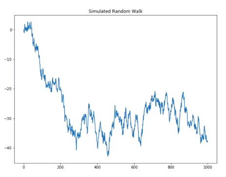
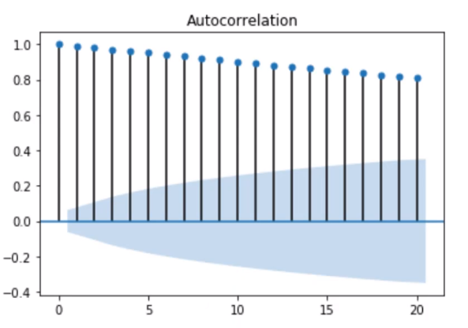
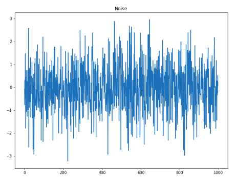
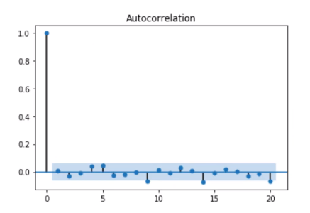

# Statistical Learning Approach

In this section we are going to talk about the statistical approach to predict a time series. The codes are available in the folder codes. But before we can discuss the statistical approach, we first have to see some simple forecast methods.

## Some simple forecast methods

Some forecast methods are extremely simple and surprisingly effective in some cases. It is important to know those methods, because it's always better to use a simple method if a complex one is producing results that are the same or worse.

### Average Method

In this method, the forecast of all future values are equal to the avarage of the historical data.

$$ ŷ_{T+h|T} = (y_1 + ... + y_T)/T $$

The notation $ŷ_{T+h|T}$ is a short-hand for the estimate of $y_{T+h}$ based on the data $y_1,...,y_T$.

### Naive Method

For naive forecasts, we simply set all forecasts to be the value of the last observation. This method works remarkably well for many economic and financial time series. Naive forecasts are optimal when data follow a random walk (see statistics), so they are called random walk forecasts.

### Seasonal Naive Method

In this case, we set each forecast to be equal to the last observed alue from the same season. For example, with monthly data, the forecast of all future March values is equal to the last observed March value.

### Drift Method

In this method, which is a variation of the Naive Method, the forecast can increase or decrease over time, and the amount of change over time (called drift) is set to be the average change seen in the historical data. This is the equivalent of drawing a line between the first and last observations, and extrapoling it into the future.

You can see the implementating of those methods in the Jupyter Notebook [simplemethods.ipynb](codes/simplemethods.ipynb).

## Residual Diagnostics

The "residuals" in a time series modela are what is left over after fitting a model. For many (but not all) time series models, the residuals are equal to the difference between the observations and the corresponding fittied values.

Residuals are useful in checking whether a model has adequately captured the information in the data. A good forecasting method yield the following properties:

1. The residuals are uncorrelated. If there are correlations between residuals, then there is information left in the residuals which should be used in computing forecasts.
2. The residuals have zero mean. If the residuals have a mean other than zero, then the forecasts are biased.

In addition to these essential properties, it is useful (but not necessary) for the residuals to also have the following properties:

3. The residuals have constant variance.
4. The residuals are normally distributed.

## Random Walk

A Random Walk model is one where the value at a given time $(y_t)$ is the value at the previous time $(y_{t-1})$ plus a random noise, that is normally distribuited (with mean of 0 and variance of 1). 

Therefore, the formula for the Random Walk is:

$$ X_{t} = X_{t-1} + Z_{t} $$

If we substitute $X_{t-1}$ with its respective formula and so on, we end up with the following:

$$ X_{t}=\sum_{i=1}^{t} Z_{i} $$

Below we can see an example of a simulated Random Walk:

The ACF of the Random Walk Model looks like the following:

We can see that the autocorrelation starts very high and slowly goes down. That is an indicative of a trend. If we want to remove that trend, we can differenciate the series to get only the noise. If we do that, we get the following result:

We can see now that there is no clear trend in the series and we have purely the noise. To make sure of that, we can also see the ACF of the difference:

In the Jupyter Notebook [randomwalk.ipynb](./codes/randomwalk.ipynb) you can see the steps to simulate a Random Walk, plot its correlogram, differenciate and then see the ACF of the difference.

## Moving Average Model 

Rather than using past values of the forecast variable in a regression, a Moving Average Model uses past errors in a regression-like model

## Autoregressive Model

## ARMA: Autoregressive Moving Average Model

## ARIMA: Autoregressive Integrated Moving Average

## SARIMA

## AIC: Akaike Information Criterion

## SARIMAX

## VAR: Vector Autoregressions

## VARMA: Vector Autoregressions Moving Average

## VARMAX: 